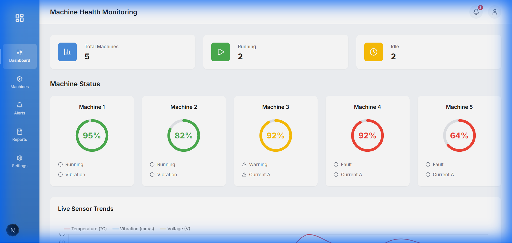
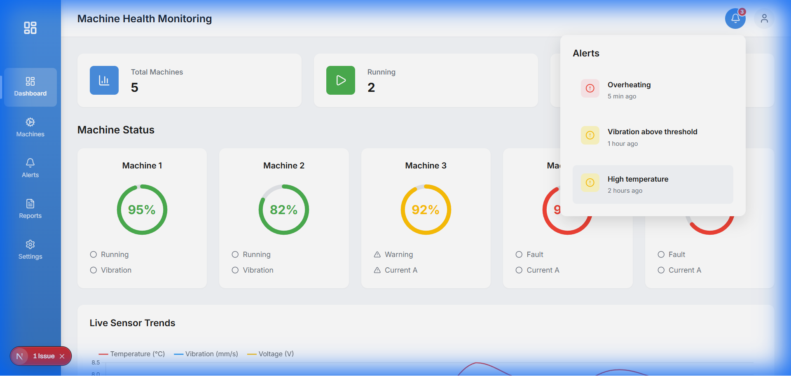
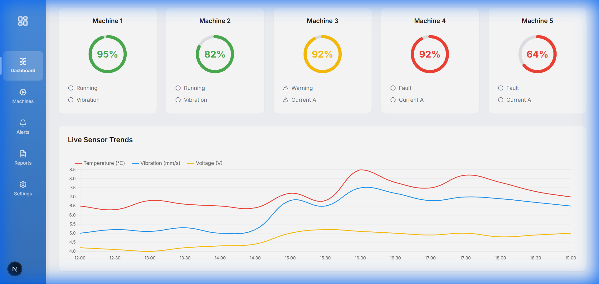

# 🏭 Machine Health Monitoring Dashboard

A modern, real-time machine health monitoring dashboard built with Next.js, featuring interactive data visualizations, status tracking, and alert management.


## ✨ Features

- 📊 **Real-time Monitoring** - Live sensor data visualization with interactive charts
- 🔔 **Smart Alerts** - Dropdown notification system with severity indicators
- 📈 **Machine Status** - Circular progress indicators showing machine health
- 🎨 **Modern UI** - Clean, responsive design with smooth animations
- 🚀 **Fast Performance** - Built with Next.js 16 and Turbopack
- 📱 **Responsive Design** - Works seamlessly on all devices

## 🖼️ Screenshots

### Dashboard Overview

*Real-time machine health monitoring with stats cards, machine status indicators, and sensor trends*

### Alerts Dropdown

*Click the notification bell to view alerts with severity indicators and timestamps*

### Sensor Trends Chart

*Interactive Chart.js visualization of temperature, vibration, and voltage readings*

## 🚀 Getting Started

### Prerequisites

- Node.js 18.0 or higher
- npm or yarn

### Installation

1. **Clone the repository**
   ```bash
   git clone https://github.com/yourusername/machine-health-monitoring.git
   cd machine-health-monitoring
   ```

2. **Install dependencies**
   ```bash
   npm install
   ```

3. **Run the development server**
   ```bash
   npm run dev
   ```

4. **Open your browser**
   
   Navigate to [http://localhost:3000](http://localhost:3000)

### Build for Production

```bash
npm run build
npm start
```

## 🛠️ Tech Stack

- **Framework:** [Next.js 16](https://nextjs.org/) with App Router
- **Language:** [TypeScript](https://www.typescriptlang.org/)
- **Styling:** CSS Modules + Custom CSS
- **Charts:** [Chart.js](https://www.chartjs.org/) with react-chartjs-2
- **Icons:** [Lucide React](https://lucide.dev/)
- **Fonts:** [Inter](https://fonts.google.com/specimen/Inter) via Google Fonts

## 📁 Project Structure

```
machine-health-monitoring/
├── app/
│   ├── layout.tsx              # Root layout with sidebar & header
│   ├── page.tsx                # Main dashboard page
│   ├── globals.css             # Global styles & design system
│   ├── machines/               # Machines page
│   ├── alerts/                 # Alerts page
│   ├── reports/                # Reports page
│   └── settings/               # Settings page
├── components/
│   ├── Sidebar.tsx             # Navigation sidebar
│   ├── Header.tsx              # Header with notifications
│   ├── StatsCard.tsx           # Stats display cards
│   ├── MachineStatusCard.tsx   # Machine health indicators
│   ├── SensorChart.tsx         # Live sensor trends chart
│   └── AlertsPanel.tsx         # Alerts dropdown panel
├── data/
│   └── mockData.ts             # Sample data
├── types/
│   └── types.ts                # TypeScript interfaces
└── public/                     # Static assets
```

## 🎯 Key Components

### Dashboard Stats
- **Total Machines** - Overview of all monitored machines
- **Running Machines** - Currently operational machines
- **Idle Machines** - Machines in fault or idle state

### Machine Status Cards
- Circular progress indicators (95%, 82%, 92%, 64%)
- Color-coded health status (🟢 Green, 🟡 Yellow, 🔴 Red)
- Real-time metrics display

### Live Sensor Trends
- Multi-line chart visualization
- Temperature (°C) monitoring
- Vibration (mm/s) tracking
- Voltage (V) measurements

### Alerts System
- Notification bell with badge counter
- Dropdown alerts panel
- Severity-based color coding
- Timestamp tracking

## 🎨 Design System

The application uses a comprehensive design system with:

- **Color Palette:** Blue primary (#4A90E2), status colors (green/yellow/red)
- **Typography:** Inter font family with consistent sizing
- **Spacing:** Token-based spacing system (xs to 2xl)
- **Animations:** Smooth transitions and hover effects
- **Responsive:** Mobile-first responsive design

## 🔄 Data Flow

Currently using mock data for demonstration. The architecture is designed to easily integrate with real APIs:

```typescript
// Example: Replace mock data with API calls
import { machines, alerts, sensorData } from '@/data/mockData';
// 👇 Replace with
const machines = await fetch('/api/machines').then(r => r.json());
```

## 🌟 Features in Detail

### Interactive Notifications
- Click the bell icon to view alerts
- Badge shows active alert count
- Click outside to dismiss
- Smooth slide-down animation

### Machine Health Monitoring
- 5 machine cards with health percentages
- SVG-based circular progress bars
- Status indicators (Running, Warning, Fault)
- Hover effects for enhanced UX

### Sensor Data Visualization
- Real-time chart updates
- Interactive tooltips
- Responsive canvas rendering
- Smooth line animations

## 🚧 Roadmap

- [ ] Real-time data integration with WebSockets
- [ ] User authentication system
- [ ] Advanced filtering and search
- [ ] Data export to CSV/PDF
- [ ] Dark mode toggle
- [ ] Mobile app (PWA)
- [ ] Historical data analysis
- [ ] Predictive maintenance alerts

## 🤝 Contributing

Contributions are welcome! Please feel free to submit a Pull Request.

1. Fork the repository
2. Create your feature branch (`git checkout -b feature/AmazingFeature`)
3. Commit your changes (`git commit -m 'Add some AmazingFeature'`)
4. Push to the branch (`git push origin feature/AmazingFeature`)
5. Open a Pull Request

## 📝 License

This project is licensed under the MIT License - see the [LICENSE](LICENSE) file for details.


## 🙏 Acknowledgments

- Next.js team for the amazing framework
- Chart.js for powerful data visualization
- Lucide for beautiful icons
- Google Fonts for the Inter typeface

---


